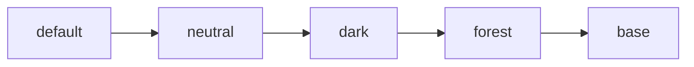

# Configuration OntoWave

OntoWave peut être configuré via un script JSON dans votre HTML.

## Configuration de Base

```html
<script type="application/json" id="ontowave-config">
{
    "title": "Ma Documentation",
    "defaultPage": "index.md",
    "mermaid": {
        "theme": "default"
    },
    "ui": {
        "showSidebar": true,
        "showSearch": true
    }
}
</script>
```

## Options Disponibles

### Général
- `title` : Titre de votre documentation
- `defaultPage` : Page d'accueil (défaut: `index.md`)
- `baseUrl` : URL de base pour les liens

### Interface
```json
{
    "ui": {
        "showSidebar": true,
        "showSearch": true,
        "theme": "default",
        "responsive": true
    }
}
```

### Mermaid
```json
{
    "mermaid": {
        "theme": "default",
        "startOnLoad": true,
        "flowchart": {
            "useMaxWidth": true
        }
    }
}
```

### PlantUML
```json
{
    "plantuml": {
        "serverUrl": "https://www.plantuml.com/plantuml",
        "format": "svg"
    }
}
```

## Thèmes Mermaid



Les thèmes disponibles sont :
- `default` - Thème par défaut
- `neutral` - Couleurs neutres
- `dark` - Mode sombre
- `forest` - Tons verts
- `base` - Minimal

> **Tip :** Vous pouvez utiliser OntoWave sans aucune configuration !

[← Retour](index.md) | [Exemples →](examples.md)
