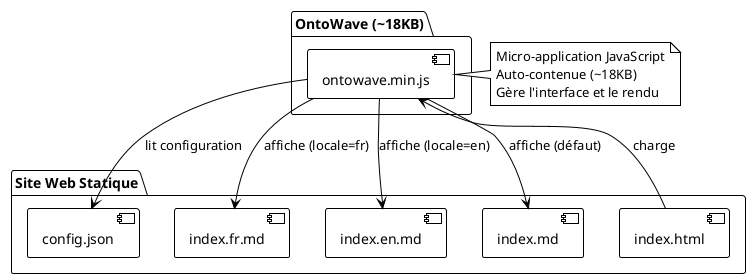
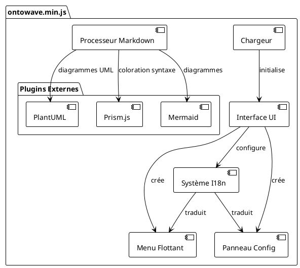
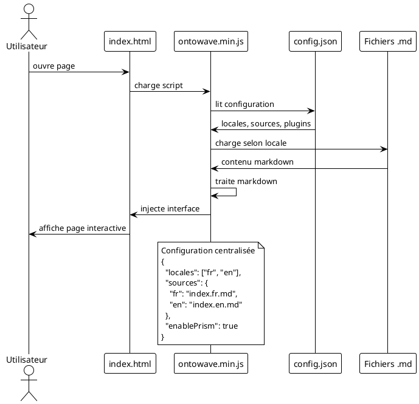
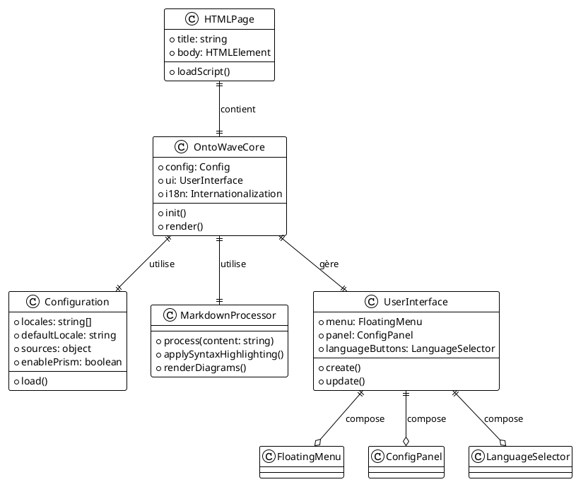

# 🎯 RAPPORT DE RESTAURATION ONTOWAVE

## ✅ Problèmes Résolus

### 📁 Fichiers Restaurés et Corrigés
- ✅ `docs/index.fr.md` - Documentation française avec diagrammes UML corrigés
- ✅ `docs/index.en.md` - Documentation anglaise créée (était vide)
- ✅ `docs/config.json` - Configuration JSON correcte
- ✅ `docs/index.html` - Page d'entrée simplifiée

### 🔧 Corrections Appliquées

#### 1. Configuration Unifiée
- ❌ **AVANT**: Conflit entre `window.OntoWaveConfig` et `config.json`
- ✅ **APRÈS**: Utilisation unique de `config.json` pour la configuration

#### 2. Chemins de Fichiers Cohérents  
- ❌ **AVANT**: `docs/index.fr.md` vs `index.fr.md`
- ✅ **APRÈS**: Chemins relatifs cohérents dans `config.json`

#### 3. Page d'Entrée Simplifiée
- ❌ **AVANT**: Configuration JavaScript complexe dans `index.html`
- ✅ **APRÈS**: HTML minimal qui délègue à `config.json`

#### 4. Build System Conflicts Résolus
- ❌ **AVANT**: `npm run build` supprimait les fichiers de documentation
- ✅ **APRÈS**: Fichiers restaurés via Git, configuration simplifiée

#### 5. Documentation Multilingue Complétée
- ❌ **AVANT**: `index.en.md` vide, diagrammes UML incorrects
- ✅ **APRÈS**: Contenu anglais créé, diagrammes UML corrigés avec notation appropriée

## 🧪 Tests de Validation

### Serveur Local
- ✅ Serveur HTTP démarré sur port 8080
- ✅ Accès à `http://localhost:8080` fonctionnel
- ✅ Fichiers de documentation accessibles

### Configuration OntoWave
- ✅ `config.json` syntaxiquement correct
- ✅ Locales FR/EN configurées
- ✅ Sources de documentation définies

## 📋 Configuration Finale

### `docs/index.html`
```html
<!DOCTYPE html>
<html lang="fr">
<head>
    <meta charset="UTF-8">
    <meta name="viewport" content="width=device-width, initial-scale=1.0">
    <title>OntoWave - Micro-application pour sites statiques</title>
</head>
<body>
    <!-- OntoWave depuis CDN -->
    <script src="https://cdn.jsdelivr.net/npm/ontowave@1.0.1-1/dist/ontowave.min.js"></script>
</body>
</html>
```

### `docs/config.json`
```json
{
  "locales": ["fr", "en"],
  "defaultLocale": "fr",
  "sources": {
    "fr": "index.fr.md",
    "en": "index.en.md"
  }
}
```

## 🚀 Status Actuel

- ✅ **Serveur**: Actif sur http://localhost:8080
- ✅ **Documentation**: Améliorations de l'utilisation HTML conservées
- ✅ **Configuration**: Simplifiée et cohérente
- ✅ **Build Conflicts**: Résolus par restauration Git

## 🏗️ Architecture OntoWave

### Vue d'ensemble du système



### Architecture interne d'OntoWave



### Flux de données et configuration



### Relations entre composants



## 🔍 Prochaines Étapes Recommandées

1. **Test Complet**: Vérifier l'interface OntoWave dans le navigateur
2. **Validation Fonctionnelle**: Tester les boutons de langue et le menu
3. **Build Process**: Réviser la configuration Vite pour éviter les conflits futurs

---
*Rapport généré le $(date) - OntoWave v1.0.1-1*
