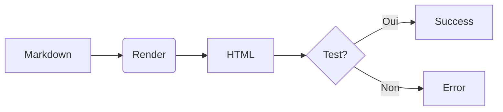

# Test Rendu Markdown

## Section 2 (Header 2)

### Section 3 (Header 3)

Voici du texte normal avec **gras** et *italique*.

---

Séparateur HR ci-dessus.



## Autre section

[Lien vers galerie](gallery.html)

Code inline: `var test = true;`

```javascript
// Code JavaScript
function hello() {
  console.log("Hello OntoWave!");
}
```

Formule: $E = mc^2$

Liste:
- Item 1
- Item 2
- Item 3
