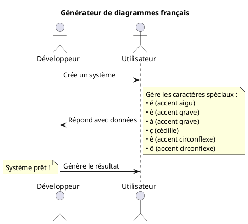
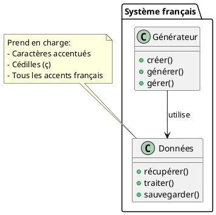

# Test d'encodage UTF-8 PlantUML

Voici un test pour vérifier que les caractères accentués français fonctionnent correctement dans PlantUML.

## Diagramme avec accents

## Test avec caractères spéciaux

## Résultat attendu

Les diagrammes ci-dessus devraient afficher correctement tous les caractères accentués français sans problème d'encodage.
