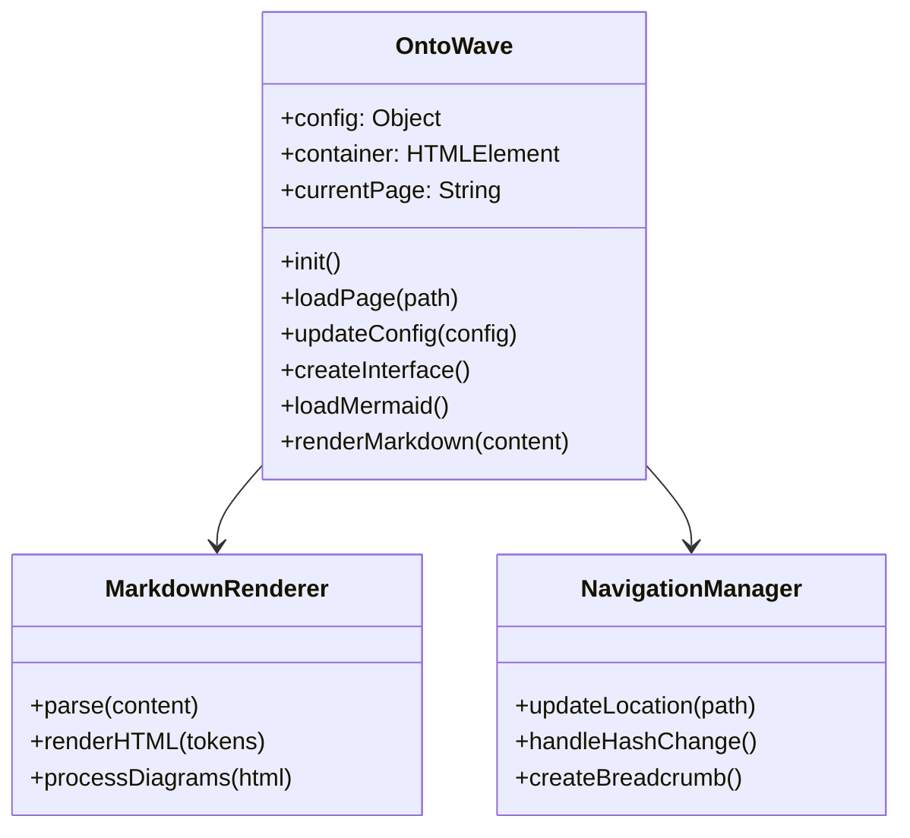

# API OntoWave

Référence complète de l'API OntoWave pour les développeurs.

## Classe OntoWave

### Constructeur

```javascript
const ontowave = new OntoWave(config);
```

**Paramètres :**
- `config` (Object) - Configuration optionnelle

### Méthodes Principales

#### `init()`
Initialise OntoWave et charge l'interface.

```javascript
await ontowave.init();
```

#### `loadPage(path)`
Charge une page Markdown spécifique.

```javascript
await ontowave.loadPage('docs/guide.md');
```

#### `updateConfig(newConfig)`
Met à jour la configuration en temps réel.

```javascript
ontowave.updateConfig({
    theme: 'dark',
    showSidebar: false
});
```

## Configuration par Défaut

```javascript
const defaultConfig = {
    title: "OntoWave Documentation",
    baseUrl: "/",
    defaultPage: "index.md",
    containerId: "ontowave-container",
    mermaid: {
        theme: "default",
        startOnLoad: true
    },
    plantuml: {
        server: "https://www.plantuml.com/plantuml",
        format: "svg"
    },
    ui: {
        theme: "default",
        responsive: true,
        animations: true
    }
};
```

## Événements

OntoWave émet des événements personnalisés :

### `ontowave:loaded`
Déclenché quand OntoWave est complètement chargé.

```javascript
document.addEventListener('ontowave:loaded', (event) => {
    console.log('OntoWave loaded:', event.detail);
});
```

### `ontowave:pageChanged`
Déclenché lors du changement de page.

```javascript
document.addEventListener('ontowave:pageChanged', (event) => {
    console.log('Page changed to:', event.detail.path);
});
```

## Architecture Interne



## Exemple d'Utilisation Avancée

```javascript
// Configuration personnalisée
const config = {
    title: "Documentation API",
    mermaid: {
        theme: "dark",
        themeVariables: {
            primaryColor: "#ff6b6b"
        }
    }
};

// Initialisation
const docs = new OntoWave(config);

// Chargement avec gestion d'erreurs
docs.init()
    .then(() => {
        console.log('✅ Documentation prête');
        
        // Navigation programmatique
        docs.loadPage('api/endpoints.md');
    })
    .catch(error => {
        console.error('❌ Erreur:', error);
    });

// Écoute des événements
document.addEventListener('ontowave:pageChanged', (e) => {
    // Analytics ou autres actions
    gtag('config', 'GA_TRACKING_ID', {
        page_path: e.detail.path
    });
});
```

## Intégration Frameworks

### React
```jsx
import { useEffect, useRef } from 'react';

function Documentation() {
    const containerRef = useRef();
    
    useEffect(() => {
        const ontowave = new OntoWave({
            containerId: containerRef.current.id
        });
        ontowave.init();
        
        return () => {
            // Cleanup si nécessaire
        };
    }, []);
    
    return <div ref={containerRef} id="docs-container" />;
}
```

### Vue.js
```vue
<template>
    <div ref="container" id="docs-container"></div>
</template>

<script>
export default {
    mounted() {
        const ontowave = new OntoWave({
            containerId: this.$refs.container.id
        });
        ontowave.init();
    }
};
</script>
```

> **Note :** OntoWave expose une API simple mais puissante pour tous vos besoins !

[← Exemples](examples.md) | [Accueil](index.md)
