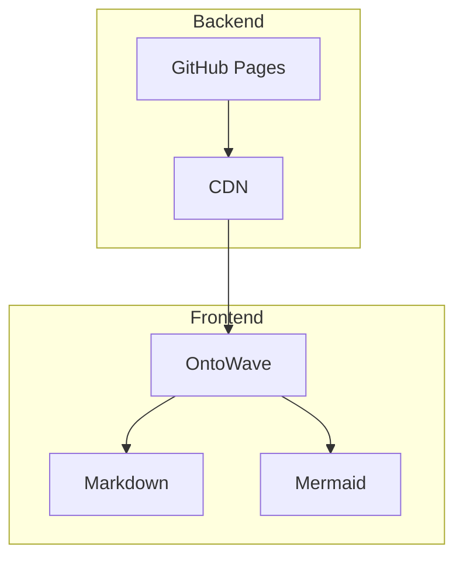
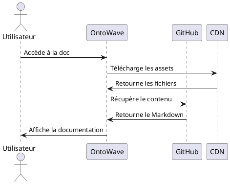

# Exemples d'Utilisation

Découvrez comment utiliser OntoWave dans différents contextes.

## 1. Site Web Simple

```html
<!DOCTYPE html>
<html>
<head>
    <title>Ma Documentation</title>
</head>
<body>
    <script src="https://cdn.jsdelivr.net/npm/ontowave@latest/dist/ontowave.min.js"></script>
</body>
</html>
```

## 2. Avec Configuration

```html
<!DOCTYPE html>
<html>
<head>
    <title>Documentation Avancée</title>
</head>
<body>
    <script type="application/json" id="ontowave-config">
    {
        "title": "Guide Technique",
        "mermaid": { "theme": "dark" }
    }
    </script>
    <script src="https://cdn.jsdelivr.net/npm/ontowave@latest/dist/ontowave.min.js"></script>
</body>
</html>
```

## 3. Diagrammes Complexes

### Architecture Système


### Workflow Git
```mermaid
gitgraph
    commit id: "Initial"
    branch develop
    checkout develop
    commit id: "Feature A"
    commit id: "Feature B"
    checkout main
    merge develop
    commit id: "Release v1.0"
```

### Séquence d'Authentification


## 4. Cas d'Usage

### Documentation Technique
- **APIs** : Référence des endpoints
- **Guides** : Tutoriels pas-à-pas
- **Changelog** : Historique des versions

### Documentation Projet
- **README** : Présentation du projet
- **Contributing** : Guide de contribution
- **Architecture** : Diagrammes techniques

### Base de Connaissances
- **FAQ** : Questions fréquentes
- **Tutorials** : Apprentissage
- **Best Practices** : Bonnes pratiques

## 5. Intégration CI/CD

```yaml
# .github/workflows/docs.yml
name: Deploy Documentation
on:
  push:
    branches: [main]
jobs:
  deploy:
    runs-on: ubuntu-latest
    steps:
      - uses: actions/checkout@v3
      - name: Deploy to GitHub Pages
        uses: peaceiris/actions-gh-pages@v3
        with:
          github_token: ${{ secrets.GITHUB_TOKEN }}
          publish_dir: ./docs
```

> **Success :** OntoWave s'intègre parfaitement dans vos workflows existants !

[← Configuration](config.md) | [API →](api.md)
