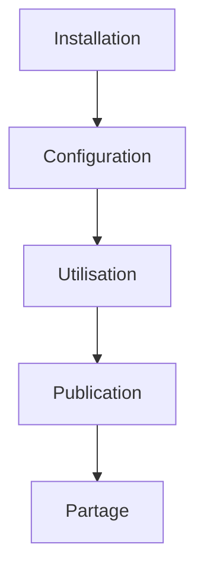
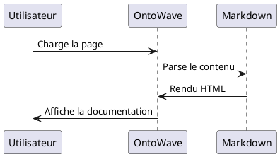

# OntoWave - Documentation Interactive

Bienvenue dans **OntoWave**, votre solution pour créer des documentations interactives avec un seul include !

## 🚀 Fonctionnalités

### ⚡ Installation Ultra-Simple
Ajoutez simplement cette ligne dans votre HTML :

```html
<script src="https://cdn.jsdelivr.net/npm/ontowave@latest/dist/ontowave.min.js"></script>
```

### 🎨 Diagrammes Intégrés

#### Mermaid


#### PlantUML


## 📖 Navigation

Explorez les sections suivantes :
- [Configuration](config.md) - Options de personnalisation
- [Exemples](examples.md) - Cas d'usage pratiques  
- [API](api.md) - Référence technique

## 🎯 Avantages

| Fonctionnalité | Description |
|---|---|
| **Zero Config** | Fonctionne immédiatement |
| **Léger** | Seulement 12KB minifié |
| **Responsive** | S'adapte à tous les écrans |
| **Interactif** | Navigation fluide |

> **Note :** OntoWave transforme automatiquement vos fichiers Markdown en documentation interactive !

---

*Créé avec ❤️ pour simplifier la documentation*
